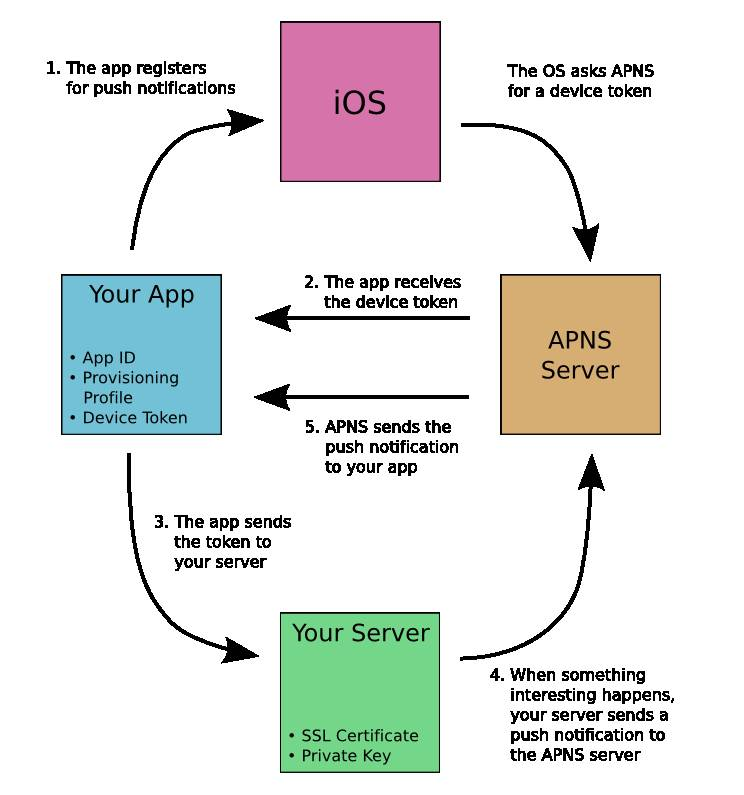

# Bookmark

[What is a provisioning profile & code signing in iOS?](https://medium.com/@abhimuralidharan/what-is-a-provisioning-profile-in-ios-77987a7c54c2)

[[iOS] 코드 사이닝 (프로비저닝 프로파일, 인증서)](https://beankhan.tistory.com/115)
[[iOS] 인증서와 코드 사이닝 이해하기](http://la-stranger.blogspot.com/2014/04/ios.html)

# APNs

> Apple Push Notification service (APNs) propagates push notifications to devices having applications registered to receive those notifications. Each device establishes an accredited and encrypted IP connection with the service and receives notifications over this persistent connection. Providers connect with APNs through a persistent and secure channel while monitoring incoming data intended for their client applications. When new data for an application arrives, the provider prepares and sends a notification through the channel to APNs, which pushes the notification to the target device..

> Apple APN(Push Notification Service)은 해당 알림을 수신하기 위해 응용 프로그램이 등록되어 있는 장치로 푸시 알림을 전파합니다. 각 장치는 서비스와의 인증되고 암호화된 IP 연결을 설정하고 이 영구 연결을 통해 알림을 받습니다. 공급업체는 클라이언트 애플리케이션을 위한 수신 데이터를 모니터링하면서 영구적이고 안전한 채널을 통해 APN에 연결합니다. 응용 프로그램에 대한 새 데이터가 도착하면 공급자는 채널을 통해 알림을 준비하여 APN으로 보내 대상 장치로 알림을 푸시합니다.
>
> 

# SDK 12.1 & XS Max의 변경점

[Upcoming App Store Submission Requirements](https://developer.apple.com/news/?id=03202019a)

# Width 100% not working on iOS

https://stackoverflow.com/questions/8889261/width-100-not-working-on-ios

> Try by simplifying your meta name viewport (at least for iOS) to the following line:
>
> ```css
> <meta name="viewport" content="width=device-width,initial-scale=1" />
> ```

# 단축어 활용

https://shareshortcuts.com/

https://routinehub.co/
