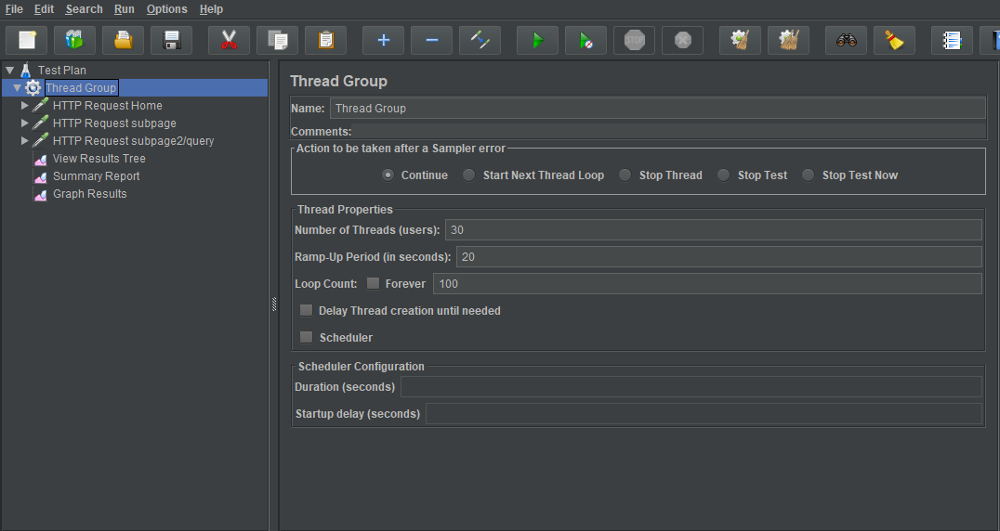

# Apache - JMeterの使い方

## Jmeter Download
### 1. [Download Apache JMeter](http://jmeter.apache.org/download_jmeter.cgi)
### 2. [Older releases](https://archive.apache.org/dist/jmeter/binaries/)

## 実行
<pre>apache-jmeter/bin/jmeter.bat</pre>

## Thread Group設定

Number of Thread : **30**  
Ramp-up Period: **20**  
Loop Count: **100**  

**0.66(2/3)秒間隔で30個のスレッドが起動され１００回ループする。**

その他の設定はTest Plan.jmxを参照